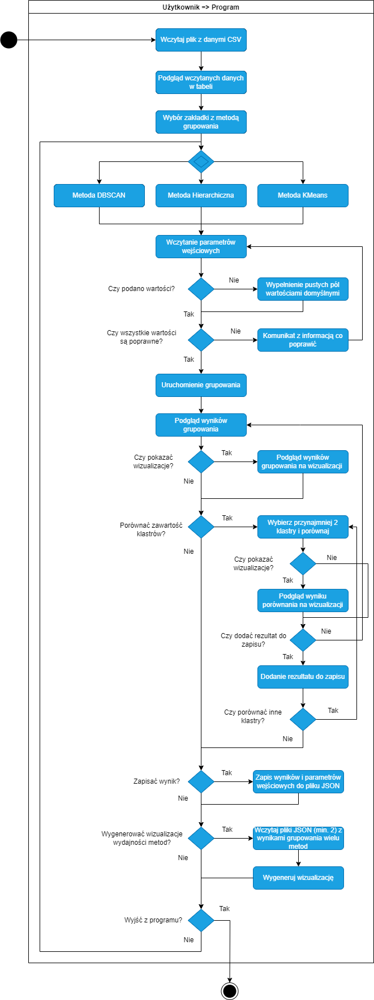

# Projekt narzędzia do testowania metod grupujących

**Narzędzie do testowania metod grupowania – KMeans, DBSCAN, hierarchiczna**  
Narzędzie zostało wykonane na potrzeby przeprowadzenia badania porównującego trzy popularne metody wykorzystywane w procesie grupowania danych (KMeans, DBSCAN, hierarchiczna).

## Założenia funkcjonalne
Przy projektowaniu aplikacji bardzo ważnym elementem jest określenie potrzeb funkcjonalnych, jakie tworzone oprogramowanie ma realizować. Przedstawione funkcjonalności za pomocą diagramu przypadków użycia ułatwia zobrazowanie możliwości, jakie użytkownik korzystający z narzędzia będzie posiadał. Diagram przedstawiony został na Rysunku poniżej (Rysunek 1).

**Rysunek 1. Diagram UML przedstawiający funkcjonalności tworzonego narzędzia.**

Planowane funkcjonalności tworzonego programu:
* wczytanie pliku z danymi (w formacie CSV), który będzie podstawą grupowania,
* możliwość dokonania grupowania obiektów w zbiorze danych metodą KMeans,
* możliwość dokonania grupowania obiektów w zbiorze danych wykorzystując metodę gęstościową (DBSCAN),
* możliwość dokonania grupowania obiektów w zbiorze danych metodą hierarchiczną,
* możliwość zdefiniowania poszczególnych parametrów wejściowych procesu grupowania według uznania użytkownika,
* podgląd wyników procesu grupowania,
* podgląd wyniku grupowania na wykresie 2D lub 3D w przypadku wykorzystania w procesie grupowania 2/3 kolumn (atrybutów),
* możliwość zapisu wyniku grupowania wraz z informacją o ustawionych parametrach wejściowych danej metody do pliku JSON,
* możliwość porównania zawartości klastrów pomiędzy metodami wraz z zapisem rezultatów do pliku JSON.
* podgląd wyniku porównania na wizualizacji z możliwością dynamicznej zmiany widoczności poszczególnych grup danych na wykresie,
* możliwość wygenerowania wykresu prezentującego wydajność wykorzystanych metod grupowania, na podstawie wczytanych plików zawierających wyniki grupowania (wielu metod) w formacie JSON (przynajmniej 2 pliki).

## Narzędzia i technologie
* Język programowania **Python**,
* Wykorzystane metody grupowania oparte o bibliotekę **scikit-learn**,
* GUI aplikacji wykonane przy wykorzystaniu biblioteki **PyQt5**,
* Środowisko programistyczne **Visual Studio Code**.

## Struktura programu
Tworzone narzędzie od strony kodu będzie się składało z czterech modułów, pierwszy skupiający w sobie integrację GUI z poszczególnymi metodami grupowania oraz zarządzanie poszczególnymi elementami składającymi się na GUI. Następne trzy będą stanowić kolejno przygotowane gotowe metody grupowania tj. metoda gęstościowa DBSCAN, metoda KMeans i metoda hierarchiczna. Poniżej znajduje się diagram klas opisujący zastosowaną strukturę (Rysunek 2).

**Rysunek 2. Diagram UML przedstawiający strukturę tworzonego narzędzia.**  
  
### Zadania poszczególnych metod:  
#### Skrypt application  
* browseFiles() – funkcja pozwalająca wczytać plik CSV do programu wykorzystując systemowe narzędzie „FileExplorer”,
* activateTabSection() – funkcja odblokowująca zakładki z metodami grupowania po wczytaniu pliku z danymi CSV,
* fillPreviewTableTab() – funkcja wypisująca do tabelarycznego podglądu wczytany plik z danymi CSV w pierwszej z dostępnych zakładek,
* fillComboBox_MetodaGęstościowa(), fillComboBox_MetodaHierarchiczna() - funkcje ustawiające odpowiednie opcje w polach GUI typu ComboBox dotyczących wykorzystanych metryk w procesie grupowania,
* grupowanie_MetodaGestosciowa(), grupowanie_MetodaHierarchiczna(), grupowanie_MetodaKMeans() – funkcje zbierające wczytane parametry wejściowe metod grupowania z dokonaniem walidacji przekazanych wartości,
* eksportDoPliku_MetodaGestosciowa(), eksportDoPliku_MetodaGestosciowa(), eksportDoPliku_MetodaGestosciowa(), eksportDoPliku_Wszystko() – funkcje przygotowujące wyniki grupowania i dane wejściowe poszczególnych lub wszystkich metod do zapisu w odpowiedniej formie w formacie JSON,
* saveFileToJson() – funkcja, która zapisuje wcześniej przygotowane dane z wynikami do zewnętrznego pliku JSON, wykorzystując przy tym systemowe narzędzie „FileExplorer”,
* showGraphKmeans(), ShowGraphHierarchiczna(), ShowGraphDBSCAN(), ShowGraphHierarchicznaDendrogram() – funkcje umożliwiające wywołanie odpowiednich metod generujących wykres wizualizujący pogrupowane dane, po kliknięciu na odpowiedni przycisk z poziomu GUI,
* setTableWidget_wyniki() – funkcja modyfikująca szerokość poszczególnych kolumn z wynikami w widoku tabelarycznym,
* fillTableWidget_wyniki() – funkcja wywoływana po zakończeniu procesu grupowania w celu wczytania uzyskanych wyników do tabelarycznego widoku w celu porównania z innymi,
* checkIfComboAllowed() – funkcja regulująca opcje comboBox w polu z parametrem „linkage”, ponieważ opcja „ward” współpracuje tylko z metryką „euclidean”,
* compareClusters() – funkcja umożliwiająca dokonania porównania zawartości pomiędzy klastrami w różnych metodach,
* addCompareResultToSave() – funkcja przygotowująca wskazany wynik porównania obiektów w klastrach do zapisu,
* removeSelectedRowFromCompareSaveTable() – funkcja usuwająca wskazany wynik z przygatowanych do zapisu.
* onHierarchicznaClustersChanged() – metoda włączająca lub wyłączająca pole dot. parametru progu odcięcia (metod hierarchiczna), w zależności od wartości z pola dot. ilości grup do wygenerowania,
* onHierarchicznaComboBoxChanged(String) – metoda definiująca możliwe opcje do wyboru w polu dot. metody łączenia (metoda hierarchiczna), w zależności od wybranej metryki,
* allFilesGeneratePerformanceGraph() – metoda generująca wykres wizualizujący wydajność wykorzystanych metod grupowania (zestawienie czasu grupowania z ilością obiektów w zbiorze danych),
* browseFiles_many() – metoda pozwalająca na wczytanie wielu plików w formacir JSON jednocześnie przy pomocy narzędzia „FileExplorer” (na potrzeby wygenerowania wizualizacji wydajności metod grupowania),
* compareGraph() – metoda decydująca jakiego typu wizualizacje należy wygenerować na podstawie ilości użytych argumentów w procesie grupowania oraz ilości grup biorących udział w porównaniu,
* SetScatterVisable() – metoda pozwalająca dynamicznie włączać lub wyłączać widoczność poszczególnych grup danych na wykresie (dotyczy wykresów z porównaniem grup),
* compareGraph2D_2methods(), compareGraph2D_3methods(), compareGraph3D_2methods(),compareGraph3D_3methods() – metody pozwalające wygenerować dynamiczny wykres wizualizujący wynik porównania zdefiniowanych grup pomiędzy metodami grupowania.

#### Skrypty DBSCAN, Hierarchiczna oraz KMeans:
* dbscanGrupowanie(DataFrame, float, int, string, []), hierarchicznaGrupowanie(DataFrame, int, string, []), kmeansGrupowanie(DataFrame, float, int, string, []) – funkcje wykonujące grupowanie, wykorzystując w tym celu przekazane parametry wejściowe. W ciele funkcji obliczane są również takie dane jak czas wykonywania się grupowania, ilość obiektów w przekazanym zbiorze, szum itp.
* dbscanGraph2D(DataFrame, [], [], bool), hierarchicznaGraph2D(), kmeansGraph2D() – funkcje pozwalające wygenerować wizualizacje ukazujące, w jaki sposób dana metoda pogrupowała obiekty w przekazanym zbiorze danych. Funkcja ta znajduje wykorzystanie tylko w przypadku, jeśli grupowanie odbywało się uwzględniając dwa atrubuty/kolumny,
* dbscanGraph3D(DataFrame, [], [], bool), hierarchicznaGraph3D(), kmeansGraph3D() – funkcje pozwalające wygenerować wizualizacje ukazujące, w jaki sposób dana metoda pogrupowała obiekty w przekazanym zbiorze danych. Funkcja ta znajduje wykorzystanie tylko w przypadku, jeśli grupowanie odbywało się uwzględniając trzy atrubuty/kolumny.
* hierarchicznaGraphDendrogram(DataFrame, string), plotDendrogram(Object, Object) – funkcje umożliwiające wygenerowanie dendrogramu grupowanych danych dla metody hierarchicznej. 

## Przepływ aktywności
Kolejną ważną czynnością, jaką możemy wykonać przy projektowaniu narzędzia jest przemyślenie i zamodelowanie przepływu czynności tworzonej aplikacji. Możemy go przedstawić za pomocą graficznego diagramu (Rysunek 3). Służy on głównie do modelowania dynamicznych aspektów systemu oraz do przedstawienia sekwencji kroków-czynności, które są wykonywane w celu przeprowadzenia pewnej akcji od początku do końca.

**Rysunek 3. Diagram UML przedstawiający przepływ aktywności.**  

Przedstawiony diagram powyżej opisuje krok po kroku, jakie czynności muszą zostać wykonane aby przeprowadzić użytkownika od momentu uruchomienia narzędzia do wygenerowania wyników grupowania z ewentualnym ich zapisem do zewnętrznego pliku. Pierwszą czynnością po uruchomieniu programu będzie wczytanie wybranego pliku CSV z danymi przez użytkownika. Po wczytaniu danych będzie możliwość podglądu w tabelarycznym widoku jak te dane się prezentują, jakie mają atrybuty/kolumny itp. Gdy dane zostaną załadowane, odblokowane zostaną zakładki z poszczególnymi metodami grupowania, na tym etapie wybieramy jedną z dostępnych i uzupełniamy puste pola dotyczące wymaganych parametrów jakie użytkownik musi zdefiniować. Po podaniu wszystkich parametrów w poprawnej formie (gdy nie podamy parametrów wejściowych zostaną wypełnione wartościami domyślnymi) możemy uruchomić proces grupowania. Jeśli jakieś z podanych wartości będą niepoprawne pojawi się odpowiedni komunikat. Gdy proces grupowania dobiegnie końca ukazane zostaną wyniki, które będziemy mogli wyeksportować do pliku JSON i będziemy mogli dokonać podglądu wyników na wykresie. W każdej chwili możemy zmieniać zakładki z metodami i testować każdą z nich porównując jak dana metoda pogrupowała te same dane. W zakładce „Wyniki” mamy możliwość porównania wszystkich trzech metod wraz z opcją porównania poszczególnych klastrów pomiędzy wykorzystanymi metodami, możemy w taki sposób poznać, jaka jest ich część wspólna oraz jakie obiekty są poza częścią wspólną. Wygenerowane rezultaty porównania można zobaczyć na wizualizacji opcjonalnie dodać do zapisu lub porzucić. Przechodząc w zakładkę „Wczytaj dane” będziemy mieli możliwość wczytania wcześniej wygenerowanych plików z wynikami w formacie JSON. Po wczytaniu plików będziemy mogli wygenerować wykres prezentujący wydajność poszczególnych metod grupowania.

## GUI - Przykłyadowe zrzuty ekranu aplikacji

